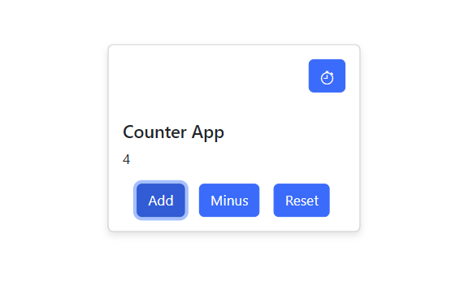
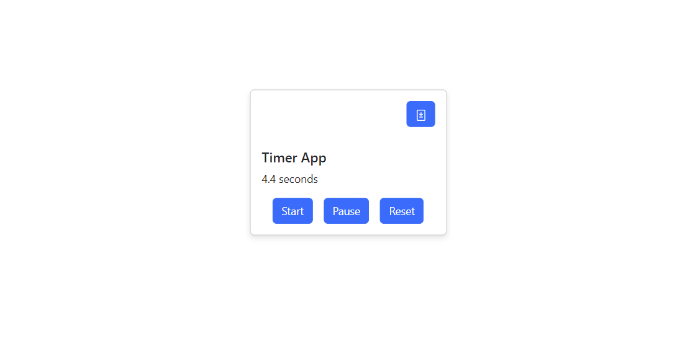

# React 2-in-1 Timer/Counter App with useSpring

A remake of the original counter app exercise in Module 2 provided by Sigma School.

## Overview

I wanted to re-do the introductory counter app exercise. I've added some bootstrap styling to make it more appealing. I also wanted to include a timer function into this application. As an extra, I wanted to add a "spring-like" movement whenever the user hovers over the content.

At some point, creating a React app requires the usage of third-party libraries. I did just that when I leveraged the useSpring hook to achieve the "bouncy" effect. And overall, it taught me how to be comfortable reading the docs and also implementing a feature others have made. 

## Credit

Thank you to Sigma School for providing me the opportunity to career-switch into the tech field. Exercises/Lessons/Examples were provided by them. https://sigmaschool.co/
